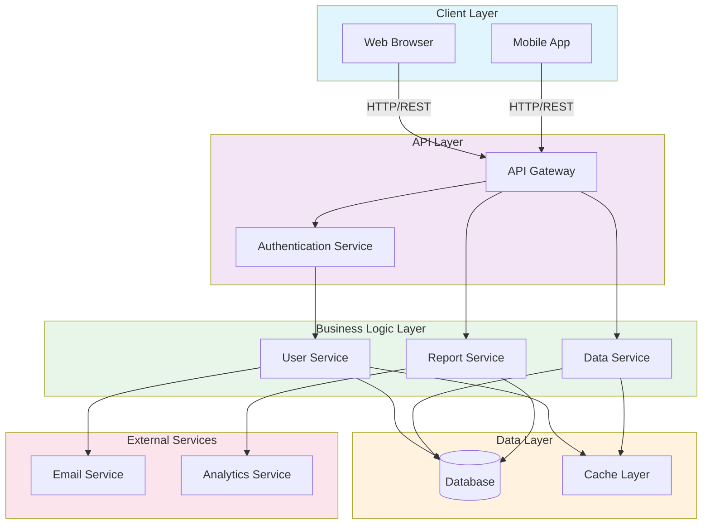

# Architecture Overview

This document provides a high-level overview of the system architecture.

## System Architecture Diagram

## Architecture Components

### Client Layer
- **Web Browser**: Web-based user interface
- **Mobile App**: Native or cross-platform mobile application

### API Layer
- **API Gateway**: Entry point for all client requests, handles routing and load balancing
- **Authentication Service**: Manages user authentication and authorization

### Business Logic Layer
- **User Service**: Handles user management and profiles
- **Data Service**: Manages core business data operations
- **Report Service**: Generates reports and analytics

### Data Layer
- **Database**: Primary data storage system
- **Cache Layer**: In-memory caching for performance optimization

### External Services
- **Email Service**: Sends notifications and emails
- **Analytics Service**: Tracks and analyzes user behavior

## Communication Flow

1. Clients send requests to the API Gateway
2. API Gateway routes requests through Authentication Service
3. Requests are processed by appropriate Business Logic services
4. Services interact with Database and Cache Layer as needed
5. External services are called for specific operations
6. Response is returned to the client
